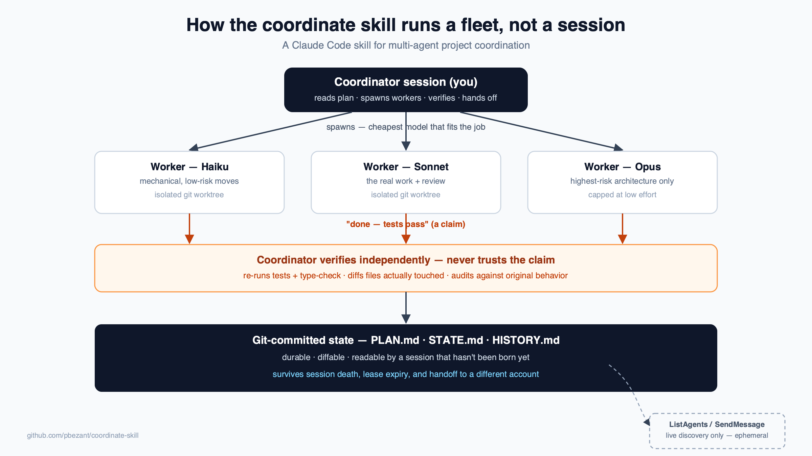

# coordinate

A Claude Code **skill** that turns Claude into a project coordinator: it reads a plan, spawns cheap worker agents on an integration branch, independently verifies what they claim (workers overstate — a lot), and hands off cleanly between sessions or even different user accounts.

You stop babysitting a single long-running agent session and start running a small fleet, with a paper trail (`PLAN.md` / `STATE.md` / `HISTORY.md`, committed to git) that any fresh session — yours or a teammate's — can pick up cold.



## What it does

- **Resumes from git-tracked state**, not conversation memory — `docs/coordination/{PLAN,STATE,HISTORY}.md` are the source of truth, so a brand-new session (or a different account) can take over exactly where the last one stopped.
- **Spawns workers in isolated worktrees**, on the cheapest model that can do the job (Haiku for mechanical moves, Sonnet for anything tenant-aware or subtle, Opus reserved for architecture at low effort only).
- **Never trusts a worker's self-report.** It independently diffs scope, runs the type-check and test suite itself, and audits behavior-preserving refactors for the kind of bug green tests don't catch (callbacks/timers/lazy requires crossing a module boundary).
- **Guards against split-brain coordination**: verifies a stale `STATE.md` before trusting it, checks for a live peer session before taking over a lease, treats the state-file push itself as the lock (not just the lease check) so two coordinators can't race each other, and detects work a human is doing directly in a worktree so it doesn't collide with it.
- **Blocks on danger, not just failing tests.** Auth, schema/migration, tenant-isolation, or payment paths always go to a human regardless of green tests; a worker's diff that blows past the plan's size ceiling gets flagged instead of auto-merged; a worker that fails on two model tiers stops escalating and asks instead of burning more budget.
- **Every escalation is logged as a defect, not just a blocker.** Symptom → root cause → countermeasure, same discipline manufacturing calls Andon — and the countermeasure gets folded back into `PLAN.md`'s worker constraints so the next worker can't repeat it, instead of the lesson living only in a HISTORY.md paragraph nobody re-reads.
- **Scans before it merges.** Greps every worker diff for secret-shaped strings before it lands, and gives a failing test one retry before calling it a real regression instead of either ignoring flakes or crying wolf.
- **Hands off instead of ballooning.** After 2-3 cycles it proposes a clean handoff to a fresh session rather than working the whole queue in one context window, and logs a budget/velocity line each time so a later session can see the trend without re-reading raw history.
- **Persists setup in `.coordinate.json`** so re-adopting a plan on a repo it's seen before skips the interview.

## Install

**Option A — copy the skill in (works today, no extra setup):**

```bash
mkdir -p .claude/skills
cp -r skills/coordinate .claude/skills/coordinate
```

Then in Claude Code: `/coordinate <path-to-your-plan>`.

**Option B — as a plugin:** this repo also ships a `.claude-plugin/` manifest so it can be added as a plugin marketplace. Plugin manifest conventions have moved fast — check `claude plugin --help` / the current Claude Code plugin docs for the exact add command your version expects.

## Usage

```
/coordinate                 # resume: reconcile STATE.md with reality, continue the queue
/coordinate status          # report only — spawn nothing, change nothing
/coordinate handoff         # write STATE/HISTORY, commit + push, print the resume line for the next session
/coordinate cleanup         # audit and remove finished worker worktrees/branches
/coordinate <plan-path>     # adopt a plan doc: create/refresh PLAN.md from it, then resume
```

The first run creates `docs/coordination/PLAN.md`, `STATE.md`, and `HISTORY.md` from the templates in [skills/coordinate/SKILL.md](skills/coordinate/SKILL.md) and asks you for your repo's commands (type-check, test, lint) and any worker constraints (banned patterns, file-size limits, files that need explicit approval).

## Why this exists

Long agent sessions degrade: context fills up, an agent starts re-deriving things it already knew, and one session becomes a single point of failure. This skill pushes work out to short-lived, narrowly-scoped workers and keeps the only thing that has to survive between sessions — the plan and its state — in git, where it's cheap to read and impossible to lose.

It was extracted from real use coordinating a multi-week refactor across many sessions and worker agents; the verification rules exist because of specific ways workers were caught overstating what they'd done. The escalation format borrows the "Andon" idea from manufacturing failure analysis — every stoppage gets a symptom, a root cause, and a countermeasure, and the countermeasure changes the process so the same defect can't recur.

## License

MIT
